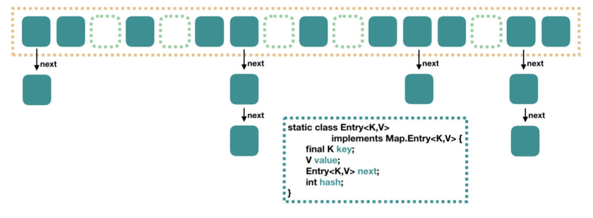

# Java容器

## 一、接口继承关系和实现

### 1、Collection

Java集合主要在java.util包中，主要包含set、list（包含queue）、map

1、Collection主要是集合List、Set、Queue的基本接口

2、Iterator：迭代器，可以通过迭代器遍历集合中的数据

3、Map：是映射表的基础接口

### 2、Collections

Collections则是集合类的一个工具类/帮助类，其中提供了一系列静态方法，用于对集合中元素进行排序、搜索以及线程安全等各种操作。

1) 排序(Sort)
使用sort方法可以根据元素的自然顺序 对指定列表按升序进行排序。列表中的所有元素都必须实现 Comparable 接口。此列表内的所有元素都必须是使用指定比较器可相互比较的

```java
1 List<Integer> list = new ArrayList<Integer>();
2         int array[] = {112, 111, 23, 456, 231 };
3         for (int i = 0; i < array.length; i++) {
4             list.add(array[i]);
5         }
6         Collections.sort(list);
7         for (int i = 0; i < array.length; i++) {
8             System.out.println(list.get(i));
9         }
```

结果：23  111  *112*  231 456

2) 混排（Shuffling）
混排算法所做的正好与 sort 相反: 它打乱在一个 List 中可能有的任何排列的踪迹。也就是说，基于随机源的输入重排该 List, 这样的排列具有相同的可能性（假设随机源是公正的）。这个算法在实现一个碰运气的游戏中是非常有用的。例如，它可被用来混排代表一副牌的 Card 对象的一个 List 。另外，在生成测试案例时，它也是十分有用的。

Collections.Shuffling(list)

3) 反转(Reverse)
使用Reverse方法可以根据元素的自然顺序 对指定列表按降序进行排序。
Collections.reverse(list)

4) 替换所以的元素(Fill)
使用指定元素替换指定列表中的所有元素。

Collections.fill(li,"aaa");

5) 拷贝(Copy)
用两个参数，一个目标 List 和一个源 List, 将源的元素拷贝到目标，并覆盖它的内容。目标 List 至少与源一样长。如果它更长，则在目标 List 中的剩余元素不受影响。
Collections.copy(list,li): 前面一个参数是目标列表 ,后一个是源列表。

6) 返回Collections中最小元素(min)
根据指定比较器产生的顺序，返回给定 collection 的最小元素。collection 中的所有元素都必须是通过指定比较器可相互比较的。
Collections.min(list)

7) 返回Collections中最小元素(max)
根据指定比较器产生的顺序，返回给定 collection 的最大元素。collection 中的所有元素都必须是通过指定比较器可相互比较的。
Collections.max(list)

8) lastIndexOfSubList
返回指定源列表中最后一次出现指定目标列表的起始位置
int count = Collections.lastIndexOfSubList(list,li);

9) IndexOfSubList
返回指定源列表中第一次出现指定目标列表的起始位置
int count = Collections.indexOfSubList(list,li);

10) Rotate
根据指定的距离循环移动指定列表中的元素
Collections.rotate(list,-1);
如果是负数，则正向移动，正数则方向移动

## 二、List

list是有序的Collection，Java List有是三个实现类：ArrayList、Vector和LinkedList

### 1、ArrayList 数组

内部使用数组实现，允许对元素的快速访问，缺点是不允许元素之间有间隔

当数组大小不满足时需要增加存储能力，就要将已有的数组的数据复制到新的空间中，当从ArrayList中间位置插入或者删除数据时，需要对数组进行复制、移动，代价比较高。因此，它适合随机查找和遍历，不适合插入和删除

### 2、Vector 数组实现，线程同步

Vector也是通过数组实现，但是它支持线程同步，即某一时刻只能有一个线程写Vector，避免多线程同时写造成不一致性，但是同步需要很高的花费，因为访问它比访问ArrayList慢

### 3、LinkedList 链表

使用链表结构存储数据，适合数据的动态插入和删除，随机访问和遍历速度慢。另外，他还提供给了List接口中没有定义的方法，用于操作表头和表尾数剧，可以当做堆栈、队列和双向队列使用。

## 三、Set

Set注重独一无二的性质，用于存储无序（存入和取出顺序不同）的元素，值不重复。对象相等的本质是对象hashCode值（Java根据对象内存地址计算出的此序号）判断的。**如果想让两个不同对象视为相等，必须覆盖Object的hashCode方法和equals方法**

### 1、HashSet

哈希表中存放的是哈希值，HashSet存储的元素的顺序不是按照存入时的顺序（和List不同），而是按照哈希值来存储，获取数据也按照哈希值来获得，元素的哈希值通过元素的hashcode方法来获取。HashSet首先判断两个元素的哈希值，如果相同会接下来比较equals方法，如果返回值为true则视为同一个元素，否则就不是同一个元素。一个hashcode位置上可以存放多个元素。

### 2、TreeSet

+ TreeSet使用二叉树的原理对新add()的对象按照指定的顺序排序，每增加一个对象会自动排序，将对象插入二叉树指定位置
+ Integer和String对象都可以进行默认的TreeSet排序，而自定义的类对象是不可以的。自定义的类对象必须首先Comparable接口，并覆写相对应的compareTo()函数才可以正常使用
+ 在腹泻compare()函数时，要返回相应的值才能使TreeSet按照一定的规则来排序
+ 比较此对象与指定对象的顺序，如果该对象小于、等于或者大于指定对象，则返回负数、零或正整数

### 3、LinkedHashSet(HashSet + LinkedHashMap)

对于LinkedHashSet，他继承于HashSet，又基于LinkedHashMap实现。底层使用LinkedHashMap来保存所有元素，所有方法与HashSet类似。

## 四、Map

### 1、HashMap（数组+链表+红黑树）

+ HashMap根据**键**的hashCode值存储数据，大多数情况下可以直接定位到它的值，因而有很快的访问速度但是遍历顺序是不确定的。HashMap最多允许一条记录的键为null，允许多条记录的值为null。

+ HashMap非线程安全，可以用Collections的synchronizedMap方法保证线程安全，或者使用ConcurrentHashMap

#### 1）Java7实现

HashMap里面是一个数组，数组中每个元素是一个单向链表。如下图：每个绿色的实体是嵌套类Entry的实例，Entry包含四个属性：key、value、hash和用于单向链表的next。



+ capacity：当前数组容量，始终保持2^n，可以扩容，扩容后数组大小为当前的2倍
+ loadFactor：负载因子，默认为0.75
+ threshold：扩容的阈值，capacity*loadFacator

#### 2）Java8实现


利用红黑树堆HashMap进行改进，有数组+链表+红黑树组成。Java7中根据hash值我们可以快速定位到数组的具体下标，之后我们需要顺着链表一个个比较下去才能找到需要的，时间复杂度取决于链表长度，为O(n)。为了降低这个部分开销，在Java8中，当链表中元素超过8个后，会将链表转为红黑树，在这些位置进行查找时可以降低时间复杂度为O(logN)

### 2、ConcurrentHashMap

#### 1）Segment段

与HashMap思路类似，但是支持并发操作。整个ConcurrentHashMap由一个个Segment组成

#### 2）线程安全（Segment继承ReenTrantLock）

ConcurrentHashMap是一个Segment数组，Segment通过继承ReentrantLock进行加锁，所以每次加锁的操作是锁住一个Segment，只要保证每一个Segment是线程安全的，也就实现了全局的线程安全

#### 3）并行度（默认16）

concurrencyLevel：并行级别、并发数、Segment 数。默认是 16， 也就是说 ConcurrentHashMap 有 16 个 Segments，所以理论上，这个时候，最多可以同时支 持 16 个线程并发写，只要它们的操作分别分布在不同的 Segment 上。这个值可以在初始化的时 候设置为其他值，但是一旦初始化以后，它是不可以扩容的。再具体到每个 Segment 内部，其实 每个 Segment 很像之前介绍的 HashMap，不过它要保证线程安全，所以处理起来要麻烦些

#### 4）Java8实现（引入红黑树）

引入红黑树进行改进

### 3、HashTable（线程安全）

Hashtable 是遗留类，很多映射的常用功能与 HashMap 类似，不同的是它承自 Dictionary 类，

并且是线程安全的，任一时间只有一个线程能写 Hashtable，并发性不如 ConcurrentHashMap，

因为 ConcurrentHashMap 引入了分段锁。Hashtable 不建议在新代码中使用，不需要线程安全

的场合可以用 HashMap 替换，需要线程安全的场合可以用 ConcurrentHashMap 替换

### 4、TreeMap（可排序）

TreeMap实现SortedMap接口，能够将他保存的记录根据键排序，默认升序，也可以指定排序的比较器，当Iterator遍历TreeMap时，得到的记录是排过序的。如果使用排序的映射，建议使用TreeMap。

在使用TreeMap时，key必须实现Comparable接口或者在构造TreeMap传入自定义的Comparator，否则会在运行时抛出java.lang.ClassCastException异常

### 5、LinkedHashMap（记录插入顺序）

LinkedHashMap 是 HashMap 的一个子类，保存了记录的插入顺序，在用 Iterator 遍历LinkedHashMap 时，先得到的记录肯定是先插入的，也可以在构造时带参数，按照访问次序排序。