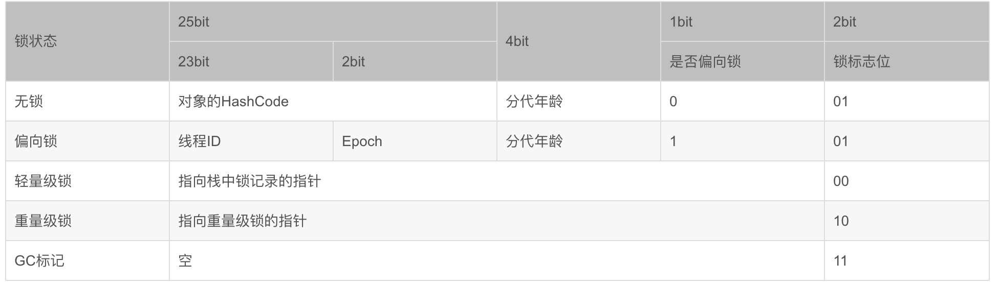

# Java类加载机制与java class对象与java对象

## 一、什么是类的加载


从上图可以看，java文件通过编译器变成了.class文件，接下来类加载器又将这些.class文件加载到JVM中。其中**类装载器**的**作用**其实就是类的加载。今天我们要讨论的就是这个环节。有了这个印象之后我们再来看**类的加载**的概念：

> 类的加载指的是将类的.class文件中的二进制数据读入到内存中，将其放在运行时数据区的方法区内，然后在堆区创建一个 java.lang.Class对象，用来封装类在方法区内的数据结构。

### 1、什么时候启动类加载器

类不是在在首次使用之前就需要被加载，而是JVM规范允许类加载器预料某个类要使用时预先加载，如果在预先加载过程中遇见.class文件缺失或者错误，程序将在首次使用该类时报LinkageError错误。如果此类一直没有被程序主动使用，类加载器也不会报错。

### 2、在哪个地方加载class文件

1. 本地磁盘
2. 数据库
3. 网上加载.class文件（Applet）
4. 压缩文件中（zar 或者jar中）
5. 从其他文件生成（JSP)

### 3、类初始化的时机

虚拟机规范中并没有强制约束何时进行加载，但是规范严格规定了有且只有下列五种情况必须对类进行初始化（加载、验证、准备都会随着发生），此为对Java类的主动引用：

+ 遇到 new、getstatic、putstatic、invokestatic 这四条字节码指令时，如果类没有进行过初始化，则必须先触发其初始化。最常见的生成这 4 条指令的场景是：使用 new 关键字实例化对象的时候；读取或设置一个类的静态字段（被 final 修饰、已在编译期把结果放入常量池的静态字段除外）的时候；以及调用一个类的静态方法的时候。
+ 使用 java.lang.reflect 包的方法对类进行反射调用的时候，如果类没有进行初始化，则需要先触发其初始化
+ 当初始化一个类的时候，如果发现其父类还没有进行过初始化，则需要先触发其父类的初始化。
+ 当虚拟机启动时，用户需要指定一个要执行的主类（包含 main() 方法的那个类），虚拟机会先初始化这个主类；
+ 当使用 JDK 1.7 的动态语言支持时，如果一个 java.lang.invoke.MethodHandle 实例最后的解析结果为 REF_getStatic, REF_putStatic, REF_invokeStatic 的方法句柄，并且这个方法句柄所对应的类没有进行过初始化，则需要先触发其初始化；

而Java类的被动引用不需要对类进行初始化：

+ 通过子类引用父类的静态字段，不会导致子类初始化。

  ```
  System.out.println(SubClass.value); // value 字段在 SuperClass 中定义
  ```

+ 通过数组定义来引用类，不会触发此类的初始化。该过程会对数组类进行初始化，数组类是一个由虚拟机自动生成的、直接继承自 Object 的子类，其中包含了数组的属性和方法。

  ```
  SuperClass[] sca = new SuperClass[10];
  ```

+ 常量在编译阶段会存入调用类的常量池中，本质上并没有直接引用到定义常量的类，因此不会触发定义常量的类的初始化。

  ```java
  System.out.println(ConstClass.HELLOWORLD);
  ```

  

## 二、类加载的过程


### 1、加载

从本地或者网络端读取一个字节流，将一些静态存储结构转化为方法区中运行时数据，最后生成一个class对象，作为方法区访问此类的入口

### 2、验证

**文件格式的验证：**
①是否以魔数0xCAFEBABE开头；
②主次版本号是否在当前虚拟机处理范围内；
③常量池中的常量是否有不被支持的常量类型等等。

**元数据的验证：**
①这个类是否有父类；
②这个类的父类是否继承了不被允许继承的类(final修饰的类)；
③这个类不是抽象类，是否实现了所有接口中要实现的方法等等。

**字节码的验证：**
①保证跳转指令不会跳转到方法体以外的字节码指令上；
②保证方法体中的类型转换是有效的等等。

**符号引用的验证：**
①能否通过类的全限定名去找到对应的类；
②符号引用中的类、字段、方法是否可以被当前类访问等等。

### 3、准备

这个过程相当于给类变量分配内存并设置初始值，这些变量所使用的的内存都在方法区中进行分配。

这里有个特殊情况，如果该字段被 `final`修饰，那么在准备阶段改字段就会被设置成咱们自定义的值。

### 4、解析

将符号引用转化为直接引用的过程：

+ 符号引用：符号引用与虚拟机的布局无关，甚至引用的目标不一定加载到了内存中。符号可以是任何形式的字面量，只要使用时能够准确的定位到目标即可。

+ 直接引用：直接引用可以直接指向目标的指针、相对偏移量或是一个能间接定位到目标的句柄。直接引用与虚拟机布局有关，如果有了直接引用，那么引用的目标必定已经在内存中存在。

### 5、初始化

在准备阶段变量已经被赋值为系统要求的默认值，在初始化阶段，则会根据程序制定的主观计划去初始化类变量和其他资源。

ps：在同一个类加载器下，一个类只会初始化一次。多个线程同时初始化一个类，只有一个线程能正常初始化，其他线程都会进行阻塞等待，直到活动线程执行初始化方法完毕。

## 三、java class对象

1. 前4个字节16进制表示0xCAFEBABE 固定不变的**魔数**（magic number，class的固定写法）

2. 看到第5字节和6字节表示副版本号0x0000和主版本号第七字节和第八字节0x0033也就是十进制51。查找class版本号可知这个class文件可以被JDK1.7.0 或者以上的虚拟机执行的class文件。

3. 紧接着主次版本号之后的是**常量池入口**，常量池是class文件结构中与其它项目关联最多的数据类型，也是占用class文件空间最大的数据项目之一，同时它还是class文件中第一个出现的表类型数据项目。由于常量池中常量的数据是不固定的，所以在常量池的入口需要放置一荐u2类型的数据，代表常量池容量计算值(constant_pool_count)。与Java语言习惯不一样的是，这个容量计数是从1而不是0开始的。将第0项常量出来的目的是为了满足后面某些指向常量池的索引值的数据在特定情况下需要表达“不引用任何一个常量池项目”的意思。class文件结构中只有常量池的容量计数是从1开始，对于其它集合类型，包括接口索引集合，字段表集合，方法表集合的容量计算都是从0开始的。常量池中主要存放两大类常量：字面量(Literal)和符号引用(Symbolic References)。字面量比较接近于Java语言层面的常量概念，如文本字符串，被声明为final的常量值等。而符号引用则属性编译原理方面的概念，包含了下面三类常量：

   1. 类和接口的全限定名(Fully Qualified Name)
   2. 字段的名称和描述符(Descriptor)
   3. 方法的名称和描述符

   常量池中的每一项常量都是一个表，共有11种结构各不相同的表结构数据，这11种表都有一个共同的特点，就是表开始的第一位是一个u1类型的标志位，代表当前这个常量属性哪种常量类型。

## 四、java对象

Java对象保存在内存中时，由以下三部分组成：

+ 对象头
+ 实例数据
+ 对齐填充字节

### 1、对象头

对象头包括三个部分：

+ Mark Word
+ 指向类的指针
+ 数组长度（只有数组对象才有）

#### 1.1 Mark Word

Mark Word记录了对象和锁有关的信息，当这个对象被synchronized关键字当成同步锁时，围绕这个锁的一系列操作都和Mark Word有关。

Mark Word在32位JVM中的长度是32bit，在64位JVM中长度是64bit。

Mark Word在不同的锁状态下存储的内容不同，在32位JVM中是这么存的：


其中无锁和偏向锁的锁标志位都是01，只是在前面的1bit区分了这是无锁状态还是偏向锁状态。

JDK1.6以后的版本在处理同步锁时存在锁升级的概念，JVM对于同步锁的处理是从偏向锁开始的，随着竞争越来越激烈，处理方式从偏向锁升级到轻量级锁，最终升级到重量级锁。

 

JVM一般是这样使用锁和Mark Word的：

1，当没有被当成锁时，这就是一个普通的对象，Mark Word记录对象的HashCode，锁标志位是01，是否偏向锁那一位是0。

2，当对象被当做同步锁并有一个线程A抢到了锁时，锁标志位还是01，但是否偏向锁那一位改成1，前23bit记录抢到锁的线程id，表示进入偏向锁状态。

3，当线程A再次试图来获得锁时，JVM发现同步锁对象的标志位是01，是否偏向锁是1，也就是偏向状态，Mark Word中记录的线程id就是线程A自己的id，表示线程A已经获得了这个偏向锁，可以执行同步锁的代码。

4，当线程B试图获得这个锁时，JVM发现同步锁处于偏向状态，但是Mark Word中的线程id记录的不是B，那么线程B会先用CAS操作试图获得锁，这里的获得锁操作是有可能成功的，因为线程A一般不会自动释放偏向锁。如果抢锁成功，就把Mark Word里的线程id改为线程B的id，代表线程B获得了这个偏向锁，可以执行同步锁代码。如果抢锁失败，则继续执行步骤5。

5，偏向锁状态抢锁失败，代表当前锁有一定的竞争，偏向锁将升级为轻量级锁。JVM会在当前线程的线程栈中开辟一块单独的空间，里面保存指向对象锁Mark Word的指针，同时在对象锁Mark Word中保存指向这片空间的指针。上述两个保存操作都是CAS操作，如果保存成功，代表线程抢到了同步锁，就把Mark Word中的锁标志位改成00，可以执行同步锁代码。如果保存失败，表示抢锁失败，竞争太激烈，继续执行步骤6。

6，轻量级锁抢锁失败，JVM会使用自旋锁，自旋锁不是一个锁状态，只是代表不断的重试，尝试抢锁。从JDK1.7开始，自旋锁默认启用，自旋次数由JVM决定。如果抢锁成功则执行同步锁代码，如果失败则继续执行步骤7。

7，自旋锁重试之后如果抢锁依然失败，同步锁会升级至重量级锁，锁标志位改为10。在这个状态下，未抢到锁的线程都会被阻塞。

#### 1.2 指向类的指针

该指针在32位JVM中的长度是32bit，在64位JVM中长度是64bit。

Java对象的类数据保存在方法区。

####1.3 数组长度

只有数组对象保存了这部分数据。

该数据在32位和64位JVM中长度都是32bit。

### 2、实例数据

对象的实例数据就是在java代码中能看到的属性和他们的值。

### 3、对齐填充数据

因为JVM要求java的对象占的内存大小应该是8bit的倍数，所以后面有几个字节用于把对象的大小补齐至8bit的倍数，没有特别的功能。

