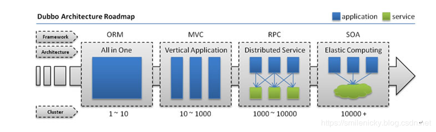
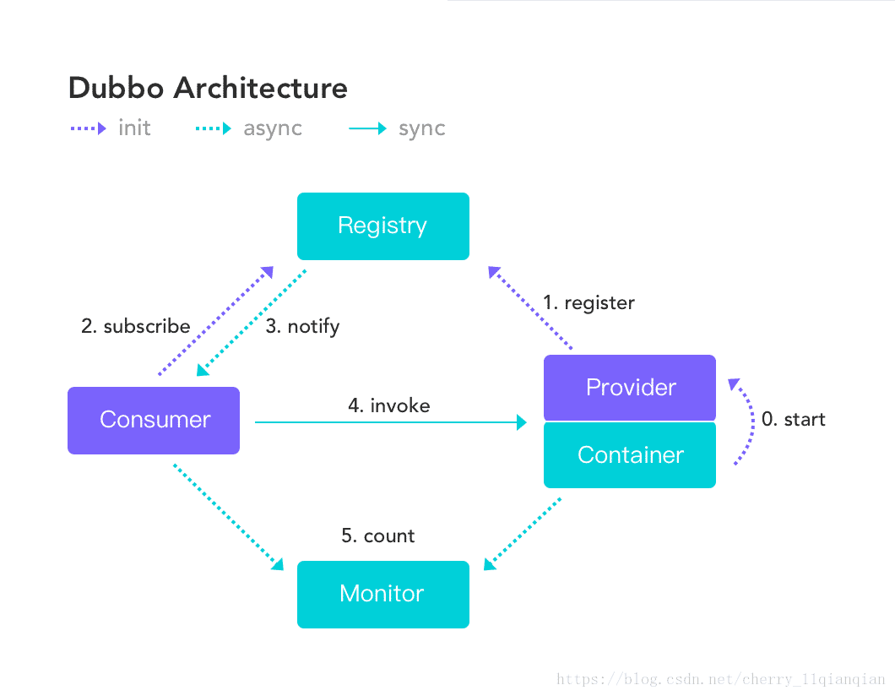
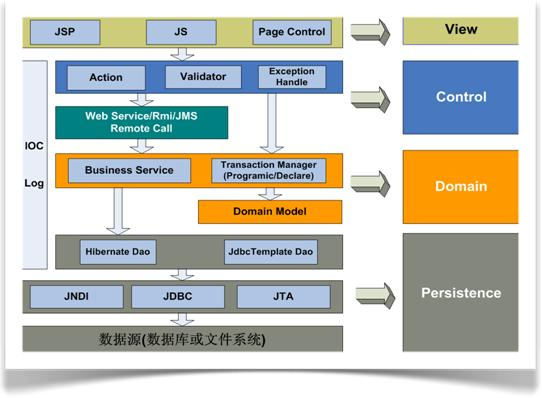

# 分布式架构学习

[参考文献1](https://blog.csdn.net/u014427391/article/details/96754952)

[参考文献2](https://www.cnblogs.com/markcd/p/9075060.html)

## 一、分布式理论

“分布式系统是若干独立计算机的集合，这些计算机对于用户来说就像单个相关系统”
分布式系统（distributed system）是建立在网络之上的软件系统。

## 二、架构演变

架构的发展是由最初的**单一应用架构**构建的，一般就是ORM框架方便数据库操作。

不过随着系统越来越复杂，单一应用架构会变得难以维护，所以架构逐渐演变出了**垂直应用架构**，所谓垂直应用架构其实就是安装业务模板进行拆分，比如可以安装业务将一个电商系统分为订单模块，用户信息管理模块，商品管理模块等等，这时候MVC框架就派上用场，MVC框架可以协助系统更好的按业务拆分，不过业务拆分后虽然是比单一应用架构更好维护了。

不过随着系统越来约复杂，发现很多共用的模块很难复用起来，这时候**分布式服务架构**登场了，分布式架构是将一些核心业务抽取出来，作为独立的服务，逐渐形成稳定的服务中心，当应用需要时，就去服务中心调服务就可以，而实现这种服务注册的肯定是RPC框架了。

当服务越来越多，容量的评估，小服务资源的浪费等问题逐渐显现，此时需增加一个调度中心基于访问压力实时管理集群容量，提高集群利用率，这时候就需要**流动计算架构**(SOA)[ Service Oriented Architecture]，用于提高机器利用率的资源调度，SOA是一个治理中心，综上所述，到目前，软件系统架构演变经历了：**单一应用架构->垂直应用架构->分布式应用架构->流动计算架构**，下面Dubbo官网的图片可以很好的描述:

## 三、RPC

### 1、RPC概念

RPC【Remote Procedure Call】是指远程过程调用，是一种进程间通信方式，他是一种技术的思想，而不是规范。它允许程序调用另一个地址空间（通常是共享网络的另一台机器上）的过程或函数，而不用程序员显式编码这个远程调用的细节。

###2、RPC核心模块
RPC有两个核心模块：通信和序列化

## 四、Dubbo架构

Dubbo是一款高性能、轻量级的开源Java RPC框架，它提供了三大核心能力：**面向接口的远程方法调用，智能容错和负载均衡，以及服务自动注册和发现。**

### 1、节点角色

1. Provider 公开远程服务的提供者
2. Consumer 呼叫远程服务的消费者
3. Registry 负责服务发现和配置的注册中心
4. Monitor 计算服务调用的数量并且耗时的监视器
5. Container 管理服务生命周期的容器

### 2、服务关系流程

基于架构图中的顺序：

0. Container负责启动，加载和运行服务提供者Provider
1. Provider服务提供者在启动时，向Registry注册中心注册自己提供的服务。
2. Consumer服务消费者在启动时，向Registry注册中心订阅自己所需的服务。
3. Registry注册中心返回服务提供者地址列表给消费者，如果有变更，注册中心将基于长连接推送变更数据给消费者。
4. 服务消费者，从提供者地址列表中，基于软负载均衡算法，选一台提供者进行调用，如果调用失败，再选另一台调用。
5. 服务消费者和提供者，在内存中累计调用次数和调用时间，定时每分钟发送一次统计数据到监控中心。

### 3、特征

Dubbo具有以下特征：连接性，稳健性，可扩展性和可升级性。

#### 3.1 连接性

- 注册中心负责服务地址的注册与查找，相当于目录服务，服务提供者和消费者只在启动时与注册中心交互，注册中心不转发请求，压力较小
- 监控中心负责统计各服务调用次数，调用时间等，统计先在内存汇总后每分钟一次发送到监控中心服务器，并以报表展示
- 服务提供者向注册中心注册其提供的服务，并汇报调用时间到监控中心，此时间不包含网络开销
- 服务消费者向注册中心获取服务提供者地址列表，并根据负载算法直接调用提供者，同时汇报调用时间到监控中心，此时间包含网络开销
- 注册中心，服务提供者，服务消费者三者之间均为长连接，监控中心除外
- 注册中心通过长连接感知服务提供者的存在，服务提供者宕机，注册中心将立即推送事件通知消费者
- 注册中心和监控中心全部宕机，不影响已运行的提供者和消费者，消费者在本地缓存了提供者列表
- 注册中心和监控中心都是可选的，服务消费者可以直连服务提供者

#### 3.2 稳健性

- 监控中心宕掉不影响使用，只是丢失部分采样数据
- 数据库宕掉后，注册中心仍能通过缓存提供服务列表查询，但不能注册新服务
- 注册中心是一个对等集群，任意一台宕掉后，将自动切换到另一台
- 注册中心全部宕掉后，服务提供者和服务消费者仍能通过本地缓存通讯
  ***（以上4点与连接性中： 注册中心和监控中心全部宕机，不影响已运行的提供者和消费者 不谋而合）\***
- 服务提供者无状态，任意一台宕掉后，不影响使用
- ***服务提供者全部宕掉后，服务消费者应用将无法使用\***，并无限次重连等待服务提供者恢复

#### 3.3 可扩展性

- Register 是一个可以动态增加其实例的对等集群，所有客户端都将自动发现新实例。
- Provider无状态，它可以动态增加部署实例，注册表将推送新的服务提供商信息给Consumer。

#### 3.4 可升级

当服务集群进一步扩展并且IT治理结构进一步升级时，需要动态部署，并且当前的分布式服务架构不会带来阻力。

### 4、服务调用流程

#### 4.1 图例说明

- 图中左边淡蓝背景的为服务消费方使用的接口，右边淡绿色背景的为服务提供方使用的接口，位于中轴线上的为双方都用到的接口。
- 图中从下至上分为十层，各层均为单向依赖，右边的黑色箭头代表层之间的依赖关系，每一层都可以剥离上层被复用，其中，Service 和 Config 层为 API，其它各层均为 SPI。
- 图中绿色小块的为扩展接口，蓝色小块为实现类，图中只显示用于关联各层的实现类。
- 图中蓝色虚线为初始化过程，即启动时组装链，红色实线为方法调用过程，即运行时调时链，紫色三角箭头为继承，可以把子类看作父类的同一个节点，线上的文字为调用的方法。

#### 4.2 export和import

Dubbo服务端接口export(导出)是将接口信息注册到注册中心Registry的过程。而客户端import(导入)远程接口是通过从注册中心Registry订阅远程服务接口，收到通知后拉取到本地的过程。
注册和订阅的过程，不需要修改服务端本地的类和方法，只需保证客户端和服务端共同引用一个包含接口的jar包。服务端和客户端分别编写简单的dubbo接口配置xml文件（或注解的方式），容器启动时就自动注册和订阅了。

#### 4.3 客户端调用过程

看上图Config层的橙色小圆点，红色实线剪头为调用链。客户端invoke远程API（Interface），实际是调用了Proxy层的RpcProxy，proxy又调用集群组件Cluster，从集群中筛选出一个Invoker作为调用者发起调用。

我们看到，在Cluster层中筛选的过程调用了Directory（实现类为RegistryDirectory）、Router、LoadBalance，分别通过Directory实现了服务的高可用，通过Router实现了智能路由功能，通过LoadBalance实现了负载均衡。

从集群模块中筛选出一个Invoker后执行invoke()方法执行方法调用，到了Protocol协议层，经过Filter组件做拦截过滤处理，如用户名、密码验证等可在此处理。过滤通过后，调用Protocol实现类如DubboProtocol或HessianProtocol等的invoke()方法。

具体的协议实现类（如DubboProtocol）会请求ExchangeClient组件，它封装了具体的数据通讯细节，是底层数据通信的代理层。因此它自然会调用底层的通信组件（默认是Netty）实现Client建立连接、Server绑定端口和数据传输(request、return)的功能。

数据传输前需要数据序列化，服务端接收到数据需要反序列化，这些都靠序列化组件实现。Codec是序列化组件的代理层，具体序列化协议，默认是Hessian，还可选择Kryo，Thrift(被Dubbo改造，与原Thrift不兼容)，dubbo, hessian2, java, json等，具体参见[Dubbo用户手册](http://dubbo.apache.org/books/dubbo-user-book/references/protocol/dubbo.html)。

#### 4.4 服务端调用过程

服务端接收到客户端的请求后，反序列化数据，通过DubboHandler协议处理请求，找到注册的本地Exporter，触发invoke()，经过过滤器处理后，调用Invoker代理层，触发真正的本地接口调用，返回数据序列化后发送给客户端。

## 五、其他

### 1、事件监听者与事件发生者：

对于事件监听者来说需要实现三个功能：

1.由于事件发生者只会把事件消息发送给实现监听接口类，所以事件监听者需要实现监听接口。

2.事件监听者要能在事件发生者上注册

3.事件监听者要对接收到的事件消息进行处理，所以就需要实现接口中的方法。

对于事件发生者需要做的是：

1.产生事件对象

2.将事件对象传递给事件监听者

### 2、领域模型设计 

(引用自[此篇文章](https://www.infoq.cn/article/cjq-ddd/))

1. View：展示层，由于 GAP 平台主要面向 B/S 架构，展示层主要由 web 资源文件组成，包括 JSP，JS 和大量的界面控件，同时还采用了 AJAX 和 Flex 等 RIA 技术，负责向用户展现丰富的界面信息，并执行用户的命令。
2. Control：控制层，负责展示层请求的转发、调度和基础验证，同时自动拦截后台返回的 Runtime 异常信息，如果控制层需要与第三方系统交互，可以通过 Action 做远程的请求。
3. Domain：领域层，是系统最为丰富的一层，主要负责处理整个系统的业务逻辑。这一层包括业务服务和领域对象，同时负责系统的事务管理。其中业务服务可以提供本地调用和共享远程服务的功能。
4. Persistence：持久化层，主要负责数据持久化，支持 O/R Mapping 和 JDBC。对数据源的访问提供多种方式。

另外, 引入了 Spring 的 IOC 容器，系统的控制层、领域层和持久化层元素都有 IOC 容器统一管理，实现完全的接口分离和解耦。同时在控制、领域和持久化层都可以引用日志服务。那么如何在去实现领域驱动设计呢？作者总结了以下四个步骤：

1. 确定业务服务（Business Service）：根据业务需求和功能模块划分，确定业务单元，每个 Business Service 是一个内聚的业务单元，覆盖相关的领域对象。
2. 定义领域对象（Entity， VO）：根据业务单元的业务逻辑定义领域对象，通过 UML 方法和设计模式描述领域对象。
3. 定义领域对象的属性和关联关系：确定领域对象的各种属性和各个领域对象之间的关联关系。
4. 为领域对象增加行为：根据业务需求（系统用例和界面原型等）为领域对象增加行为，并定义哪些方法要被业务服务引用。